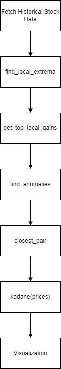
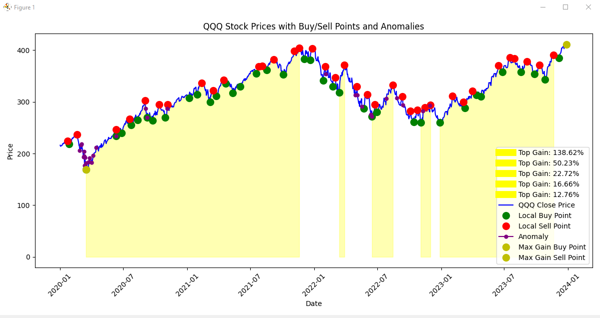
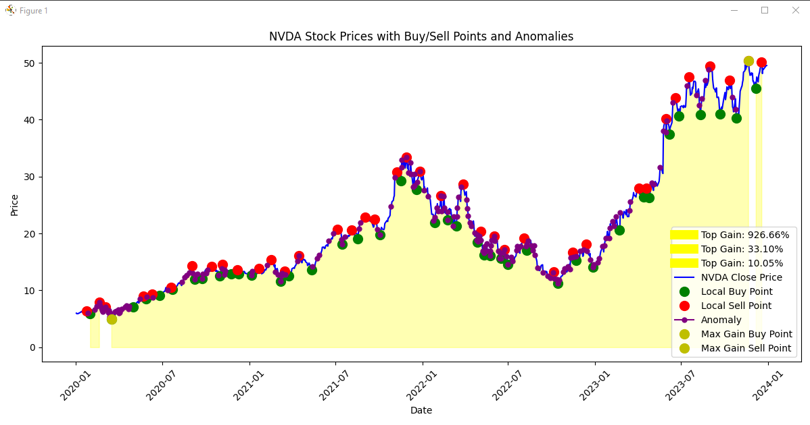

Minimal Report for Stock Analysis Project
1. Description of the Project
The primary goal of this project is to analyze historical stock price data to identify key market trends, detect anomalies, and explore strategies for maximizing profit opportunities. By applying computational algorithms, the project focuses on gaining insights into stock performance over time and identifying significant events that impact market behavior.

This analysis addresses challenges such as market volatility and unexpected price shifts by detecting local gains and anomalies, which can serve as early indicators for strategic investment decisions.

The goals of the project include:

Detecting local extrema (highs and lows) to understand potential entry and exit points for investments.
Identifying anomalies caused by significant events (e.g., economic shifts, company announcements).
Optimizing profit opportunities using algorithms like Kadane’s Algorithm for maximum subarray sum.
Comparing trends using financial data visualization and generating meaningful insights from historical trends.
2. Type-Specific Considerations
Choice of Financial Dataset
The dataset used for this analysis consists of historical stock price data retrieved from Yahoo Finance using the yfinance library. This dataset spans the period from January 1, 2020, to January 1, 2024, with a focus on the impact of significant global events (e.g., the COVID-19 pandemic and 2022 tech layoffs).

Stock ticker input: The program allows for dynamic input of stock tickers, enabling analysis across various companies or indices (e.g., QQQ).
Date range and change threshold configuration: Constants are used to control the date range and anomaly detection thresholds, making the analysis more customizable.
Algorithms Used for Processing and Analysis
Merge Sort:

Used to efficiently sort stock prices based on different parameters, enabling the quick identification of patterns.
Kadane's Algorithm:

Applied to find the maximum profit possible by analyzing the maximum subarray sum of price changes over time.
Local Extrema Detection:

Helps identify peaks and troughs in the stock price, highlighting areas where potential gains or losses occur.
Closest Pair of Points Algorithm (for anomaly detection):

This algorithm is employed to measure unusual clustering of prices or significant deviations, allowing the detection of outliers or anomalies in stock movements.
Consideration of Market Events and Anomalies
Given that stock prices are sensitive to external events (e.g., COVID-19 or tech layoffs), the algorithms are designed to handle unexpected spikes or dips. The system looks for significant deviations using the closest pair of points algorithm and generates alerts for anomalies.

Additionally, local extrema detection ensures the system can track periods of significant movement, such as rallies or crashes, which are relevant for both long- and short-term investors.

Structure of the code with diagram and comments

Summary of Developed Functions
1. find_local_extrema(prices, dates, window=7)
Purpose:
Identifies local minima and maxima (buy and sell points) in stock prices over a specified time window.

Key Logic:

A price point is considered a local minimum if it is lower than all surrounding prices within the window.
A local maximum is found if a price point is higher than all prices within the same window.
Returns two lists: one for buy points (local minima) and one for sell points (local maxima).
2. get_top_local_gains(prices, dates, buy_points, sell_points, min_gain=3)
Purpose:
Calculates and retrieves the top 5 non-overlapping local gains between buy and sell points.

Key Logic:

Computes the percentage gain between each pair of buy and sell points.
Filters out gains below the minimum gain threshold (default is 3%).
Sorts gains by percentage gain and gain rate.
Selects the top 5 non-overlapping gains to avoid overlapping timeframes.
3. find_anomalies(prices, percentage_threshold)
Purpose:
Detects anomalies in stock prices based on the percentage change between consecutive days.

Key Logic:

For each day, calculates the percentage change from the previous day.
If the absolute change exceeds the percentage threshold (default set to 4%), the price is flagged as an anomaly.
4. closest_pair(prices, dates, threshold=0.05)
Purpose:
Uses the closest pair of points algorithm to detect price anomalies.

Key Logic:

Converts dates to UNIX timestamps and stores both timestamps and prices in a KDTree.
Finds points within the given threshold radius.
If the price difference between two close points exceeds 5% of the original price, it is flagged as an anomaly.
5. kadane(prices)
Purpose:
Implements Kadane’s Algorithm to find the maximum subarray sum, which identifies the maximum cumulative gain in stock prices.

Key Logic:

Iterates through the list of price changes, maintaining both a current maximum and a global maximum.
Tracks the start and end indices of the maximum gain period.
Returns the maximum gain value along with the corresponding start and end indices.
6. Main Code Block
Purpose:

Fetches historical stock data based on user input for the ticker symbol.
Finds local extrema, calculates top local gains, and detects anomalies using different algorithms.
Plots stock prices along with identified points (buy/sell, anomalies, and gains) for visualization.

Instructions for Using the System
Constants
You can modify the following constants to customize your analysis:

START_DATE: Start date for data collection (default: "2020-01-01").
END_DATE: End date for data collection (default: "2024-01-01").
WINDOW_SIZE: Size of the window for local extrema detection (default: 7 days).
MIN_GAIN_THRESHOLD: Minimum percentage gain for local gains (default: 3%).
PERCENTAGE_THRESHOLD: Threshold for detecting anomalies (default: 4%).
CLOSEST_PAIR_THRESHOLD: Distance threshold for closest pair anomaly detection (default: 0.05).
TOP_GAIN_LIMIT: Maximum number of top gains to display (default: 5).
Loading Data

Input the stock ticker (e.g., QQQ) when prompted.
Data will be downloaded from Yahoo Finance based on the defined date range.
Analysis

Local Extrema: Identifies buy/sell points using the specified window size.
Top Gains: Displays the top non-overlapping gains exceeding the minimum gain threshold.
Anomalies: Detects significant price changes exceeding the percentage threshold.
Closest Pair: Finds anomalies based on the closest pair threshold.
Kadane’s Algorithm

Calculates the maximum continuous gain within the selected period.
Generating Reports

Results are plotted with highlighted buy/sell points, anomalies, and top gains for easy visualization.

Verification of Code Functionality
Here are some example screenshots demonstrating the functionality of the program using the stock ticker QQQ. These screenshots illustrate how the program analyzes historical stock data, identifies local buy and sell points, detects anomalies, and visualizes the results. You will see the top local gains, anomalies highlighted on the graph, and the maximum gain calculated using Kadane's Algorithm. Notably, the analysis reveals a significant number of anomalies during 2020 when the COVID pandemic occurred and in 2022 during major tech layoffs, providing a clear view of the stock's performance and potential investment opportunities.

Discussion of Findings
Insights Gained:

The analysis identified significant local gains and anomalies in stock prices, particularly during notable market events (e.g., pandemic fluctuations).
The combination of local extrema and anomaly detection provided a comprehensive view of potential investment opportunities.
Challenges Faced:

Implementing the closest pair algorithm for anomaly detection required careful handling of large datasets and performance considerations.
Adjusting parameters (e.g., window size, gain thresholds) to optimize results required iterative testing and fine-tuning.
Limitations:

The model relies on historical data, which may not accurately predict future performance due to market volatility.
The effectiveness of anomaly detection is sensitive to the chosen thresholds and may require customization based on specific stock behavior.
Areas for Improvement:

Integrating machine learning techniques for more robust anomaly detection and prediction models.
Expanding the system to include real-time data analysis and alerts for active trading opportunities.
